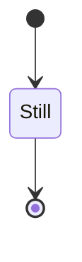

import { CodeSurfer, CodeSurferColumns, Step } from "code-surfer";
import { duotoneDark, github, vsDark } from "@code-surfer/themes";

import BasicUsageDemo from "./components/01.basic-usage/demo.jsx";
import BasicUsageWithoutCache from './components/01.basic-usage/homemade/BasicUsageWithoutCache.jsx'
import BasicUsage from './components/01.basic-usage/homemade/BasicUsage.jsx'
import Revalidate from './components/01.basic-usage/homemade/Revalidate.jsx'

import DeduplicationDemo from './components/02.deduplication/demo.jsx'
import NoDeduping from './components/02.deduplication/homemade/no-deduping.jsx'
import Deduplication from './components/02.deduplication/homemade/index.jsx'

import FocusRevalidateDemo from './components/03.focus-revalidate/demo.jsx'
import NoRevalidate01 from './components/03.focus-revalidate/homemade/no-revalidate-1.jsx'
import NoRevalidate02 from './components/03.focus-revalidate/homemade/no-revalidate-2.jsx'
import FocusRevalidate from './components/03.focus-revalidate/homemade/index.jsx'

<CodeSurferColumns themes={[vsDark, github]} sizes={[3, 2]}>

<Step>

```jsx title="Example" showNumbers="true"
import React, { useState } from "react";
import useSWR from "swr";

const fetcher = (id) =>
  fetch(`https://api.github.com/repos/${id}`).then((r) =>
    r.json()
  );

export default function TrendingProjects() {
  const [id, setId] = useState("facebook/react");
  const { data } = useSWR(id, fetcher);

  return (
    <div>
      <h1>Trending Projects</h1>

      <div>
        <button onClick={() => setId("facebook/react")}>
          React
        </button>{" "}
        <button onClick={() => setId("vercel/swr")}>
          SWR
        </button>{" "}
        <button onClick={() => setId("TanStack/query")}>
          TanStack Query
        </button>
      </div>

      {data ? (
        <>
          <h2>{id}</h2>
          <ul>
            <li>forks: {data.forks_count}</li>
            <li>stars: {data.stargazers_count}</li>
            <li>watchers: {data.watchers}</li>
          </ul>
        </>
      ) : (
        <p>loading...</p>
      )}
    </div>
  );
}
```

<div style={{ height: "70%", width: "70%", fontSize: 20 }}>
  <BasicUsageDemo />
</div>

</Step>

<Step>

```diff 9:43
```

<div style={{ height: "70%", width: "70%", fontSize: 20 }}>
  <BasicUsageDemo />
</div>

</Step>

<Step>

```diff 4:7,11
```

<div style={{ height: "70%", width: "70%", fontSize: 20 }}>
  <BasicUsageDemo />
</div>

</Step>

<Step>

```diff

```

<div style={{ height: "70%", width: "70%", fontSize: 20 }}>
  <BasicUsageDemo />
</div>

</Step>

</CodeSurferColumns>

---

<CodeSurfer theme={vsDark}>

```jsx showNumbers="true"
import React, { useState } from "react";
import useSWR from "swr";

const fetcher = (id) =>
  fetch(`https://api.github.com/repos/${id}`).then((r) =>
    r.json()
  );

export default function TrendingProjects() {
  const [id, setId] = useState("facebook/react");
  const { data } = useSWR(id, fetcher);

  return (
    <div>
      <h1>Trending Projects</h1>

      <div>
        <button onClick={() => setId("facebook/react")}>
          React
        </button>{" "}
        <button onClick={() => setId("vercel/swr")}>
          SWR
        </button>{" "}
        <button onClick={() => setId("TanStack/query")}>
          TanStack Query
        </button>
      </div>

      {data ? (
        <>
          <h2>{id}</h2>
          <ul>
            <li>forks: {data.forks_count}</li>
            <li>stars: {data.stargazers_count}</li>
            <li>watchers: {data.watchers}</li>
          </ul>
        </>
      ) : (
        <p>loading...</p>
      )}
    </div>
  );
}
```

```diff 2
```

```jsx subtitle="Let's build our own SWR!"
import React, { useState } from "react";

const useSWR = {}

const fetcher = (id) =>
  fetch(`https://api.github.com/repos/${id}`).then((r) =>
    r.json()
  );

export default function TrendingProjects() {
  const [id, setId] = useState("facebook/react");
  const { data } = useSWR(id, fetcher);

  return (
    <div>
      <h1>Trending Projects</h1>

      <div>
        <button onClick={() => setId("facebook/react")}>
          React
        </button>{" "}
        <button onClick={() => setId("vercel/swr")}>
          SWR
        </button>{" "}
        <button onClick={() => setId("TanStack/query")}>
          TanStack Query
        </button>
      </div>

      {data ? (
        <>
          <h2>{id}</h2>
          <ul>
            <li>forks: {data.forks_count}</li>
            <li>stars: {data.stargazers_count}</li>
            <li>watchers: {data.watchers}</li>
          </ul>
        </>
      ) : (
        <p>loading...</p>
      )}
    </div>
  );
}
```

```diff 12
```

```diff 3
```

```jsx
import React, { useState } from "react";

const useSWR = (key, fetcher) => {
  const [data, setData] = useState();

  return { data };
};

const fetcher = (id) =>
  fetch(`https://api.github.com/repos/${id}`).then((r) =>
    r.json()
  );

export default function TrendingProjects() {
  const [id, setId] = useState("facebook/react");
  const { data } = useSWR(id, fetcher);

  return (
    <div>
      <h1>Trending Projects</h1>

      <div>
        <button onClick={() => setId("facebook/react")}>
          React
        </button>{" "}
        <button onClick={() => setId("vercel/swr")}>
          SWR
        </button>{" "}
        <button onClick={() => setId("TanStack/query")}>
          TanStack Query
        </button>
      </div>

      {data ? (
        <>
          <h2>{id}</h2>
          <ul>
            <li>forks: {data.forks_count}</li>
            <li>stars: {data.stargazers_count}</li>
            <li>watchers: {data.watchers}</li>
          </ul>
        </>
      ) : (
        <p>loading...</p>
      )}
    </div>
  );
}
```

```jsx
import React, { useState, useEffect } from "react";

const useSWR = (key, fetcher) => {
  const [data, setData] = useState();

  useEffect(() => {
    async function fetch() {
      setData(undefined);
      const newData = await fetcher(key);
      setData(newData);
    }
    fetch();
  }, [fetcher, key]);

  return { data };
};

const fetcher = (id) =>
  fetch(`https://api.github.com/repos/${id}`).then((r) =>
    r.json()
  );

export default function TrendingProjects() {
  const [id, setId] = useState("facebook/react");
  const { data } = useSWR(id, fetcher);

  return (
    <div>
      <h1>Trending Projects</h1>

      <div>
        <button onClick={() => setId("facebook/react")}>
          React
        </button>{" "}
        <button onClick={() => setId("vercel/swr")}>
          SWR
        </button>{" "}
        <button onClick={() => setId("TanStack/query")}>
          TanStack Query
        </button>
      </div>

      {data ? (
        <>
          <h2>{id}</h2>
          <ul>
            <li>forks: {data.forks_count}</li>
            <li>stars: {data.stargazers_count}</li>
            <li>watchers: {data.watchers}</li>
          </ul>
        </>
      ) : (
        <p>loading...</p>
      )}
    </div>
  );
}
```

```diff
```

</CodeSurfer>

---

<CodeSurferColumns themes={[vsDark, github]} sizes={[3, 2]}>

<Step>

```jsx showNumbers="true"
import React, { useState, useEffect } from "react";

const useSWR = (key, fetcher) => {
  const [data, setData] = useState();

  useEffect(() => {
    async function fetch() {
      setData(undefined);
      const newData = await fetcher(key);
      setData(newData);
    }
    fetch();
  }, [fetcher, key]);

  return { data };
};

const fetcher = (id) =>
  fetch(`https://api.github.com/repos/${id}`).then((r) =>
    r.json()
  );

export default function TrendingProjects() {
  const [id, setId] = useState("facebook/react");
  const { data } = useSWR(id, fetcher);

  return (
    <div>
      <h1>Trending Projects</h1>

      <div>
        <button onClick={() => setId("facebook/react")}>
          React
        </button>{" "}
        <button onClick={() => setId("vercel/swr")}>
          SWR
        </button>{" "}
        <button onClick={() => setId("TanStack/query")}>
          TanStack Query
        </button>
      </div>

      {data ? (
        <>
          <h2>{id}</h2>
          <ul>
            <li>forks: {data.forks_count}</li>
            <li>stars: {data.stargazers_count}</li>
            <li>watchers: {data.watchers}</li>
          </ul>
        </>
      ) : (
        <p>loading...</p>
      )}
    </div>
  );
}
```

<div style={{ height: "70%", width: "70%", fontSize: 20 }}>
  <BasicUsageWithoutCache />
</div>

</Step>

<Step>

```diff subtitle="Cache?"
```

<div style={{ height: "70%", width: "70%", fontSize: 20 }}>
  <BasicUsageWithoutCache />
</div>

</Step>

<Step>

```diff 3:16"
```

<div style={{ height: "70%", width: "70%", fontSize: 20 }}>
  <BasicUsageWithoutCache />
</div>

</Step>

<Step>

```jsx
import React, { useState, useEffect, useRef } from "react";

const cache = new Map();

const useSWR = (key, fetcher) => {
  const keyRef = useRef(key);
  const [data, setData] = useState();

  useEffect(() => {
    async function fetch() {
      const newData = await fetcher(key);

      keyRef.current = key;
      cache.set(key, newData);

      setData(newData);
    }
    fetch();
  }, [fetcher, key]);

  return {
    data: keyRef.current === key ? data : cache.get(key),
  };
};

const fetcher = (id) =>
  fetch(`https://api.github.com/repos/${id}`).then((r) =>
    r.json()
  );

export default function TrendingProjects() {
  const [id, setId] = useState("facebook/react");
  const { data } = useSWR(id, fetcher);

  return (
    <div>
      <h1>Trending Projects</h1>

      <div>
        <button onClick={() => setId("facebook/react")}>
          React
        </button>{" "}
        <button onClick={() => setId("vercel/swr")}>
          SWR
        </button>{" "}
        <button onClick={() => setId("TanStack/query")}>
          TanStack Query
        </button>
      </div>

      {data ? (
        <>
          <h2>{id}</h2>
          <ul>
            <li>forks: {data.forks_count}</li>
            <li>stars: {data.stargazers_count}</li>
            <li>watchers: {data.watchers}</li>
          </ul>
        </>
      ) : (
        <p>loading...</p>
      )}
    </div>
  );
}
```

<div style={{ height: "70%", width: "70%", fontSize: 20 }}>
  <BasicUsage />
</div>

</Step>

<Step>

```diff 3:24 subtitle="Stale While Revalidate?"
```

<div style={{ height: "70%", width: "70%", fontSize: 20 }}>
  <BasicUsage />
</div>

</Step>

<Step>

```diff 3:24 subtitle="SWR is a strategy to first return the data from cache (stale), then send the fetch request (revalidate), and finally come with the up-to-date data."
```

<div style={{ height: "70%", width: "70%", fontSize: 20 }}>
  <BasicUsage />
</div>

</Step>

<Step>

```jsx 14:26
import React, {
  useState,
  useEffect,
  useRef,
  useCallback,
} from "react";

const cache = new Map();

const useSWR = (key, fetcher) => {
  const keyRef = useRef(key);
  const [data, setData] = useState();

  const revalidate = useCallback(async () => {
    const newData = await fetcher(key);

    keyRef.current = key;
    cache.set(key, newData);

    setData(newData);
  }, [fetcher, key]);

  useEffect(() => {
    revalidate();
  }, [revalidate]);

  return {
    data: keyRef.current === key ? data : cache.get(key),
  };
};

const fetcher = (id) =>
  fetch(`https://api.github.com/repos/${id}`).then((r) =>
    r.json()
  );

export default function TrendingProjects() {
  const [id, setId] = useState("facebook/react");
  const { data } = useSWR(id, fetcher);

  return (
    <div>
      <h1>Trending Projects</h1>

      <div>
        <button onClick={() => setId("facebook/react")}>
          React
        </button>{" "}
        <button onClick={() => setId("vercel/swr")}>
          SWR
        </button>{" "}
        <button onClick={() => setId("TanStack/query")}>
          TanStack Query
        </button>
      </div>

      {data ? (
        <>
          <h2>{id}</h2>
          <ul>
            <li>forks: {data.forks_count}</li>
            <li>stars: {data.stargazers_count}</li>
            <li>watchers: {data.watchers}</li>
          </ul>
        </>
      ) : (
        <p>loading...</p>
      )}
    </div>
  );
}
```

<div style={{ height: "70%", width: "70%", fontSize: 20 }}>
  <Revalidate />
</div>

</Step>

<Step>

```diff 8:30 title="Caching"
```

<div style={{ height: "70%", width: "70%", fontSize: 20 }}>
  <Revalidate />
</div>

</Step>

<Step>

```diff 37:71
```

<div style={{ height: "70%", width: "70%", fontSize: 20 }}>
  <Revalidate />
</div>

</Step>

<Step>

```jsx
import React, {
  useState,
  useEffect,
  useRef,
  useCallback,
} from "react";

const cache = new Map();

const useSWR = (key, fetcher) => {
  const keyRef = useRef(key);
  const [data, setData] = useState();

  const revalidate = useCallback(async () => {
    const newData = await fetcher(key);

    keyRef.current = key;
    cache.set(key, newData);

    setData(newData);
  }, [fetcher, key]);

  useEffect(() => {
    revalidate();
  }, [revalidate]);

  return {
    data: keyRef.current === key ? data : cache.get(key),
  };
};

const fetcher = (id) =>
  fetch(`https://api.github.com/repos/${id}`).then((r) =>
    r.json()
  );

export default function TrendingProjects() {
  const [id, setId] = useState("facebook/react");
  const { data } = useSWR(id, fetcher);
  const { data: dupingData } = useSWR(id, fetcher);

  return (
    <div>
      <h1>Trending Projects</h1>

      <div>
        <button onClick={() => setId("facebook/react")}>
          React
        </button>{" "}
        <button onClick={() => setId("vercel/swr")}>
          SWR
        </button>{" "}
        <button onClick={() => setId("TanStack/query")}>
          TanStack Query
        </button>
      </div>

      {data ? (
        <>
          <h2>{id}</h2>
          <ul>
            <li>forks: {data.forks_count}</li>
            <li>stars: {data.stargazers_count}</li>
            <li>watchers: {data.watchers}</li>
          </ul>
        </>
      ) : (
        <p>loading...</p>
      )}

      {dupingData ? (
        <>
          <h2>{id}</h2>
          <ul>
            <li>forks: {data.forks_count}</li>
            <li>stars: {data.stargazers_count}</li>
            <li>watchers: {data.watchers}</li>
          </ul>
        </>
      ) : (
        <p>loading...</p>
      )}
    </div>
  );
}
```

<div style={{ height: "70%", width: "70%", fontSize: 20 }}>
  <NoDeduping />
</div>

</Step>

<Step>

```diff 40,70:82 subtitle="Request deduplication?"
```

<div style={{ height: "70%", width: "70%", fontSize: 20 }}>
  <NoDeduping />
</div>

</Step>

<Step>

```diff 8:30
```

<div style={{ height: "70%", width: "70%", fontSize: 20 }}>
  <NoDeduping />
</div>

</Step>

<Step>

```jsx
import React, {
  useState,
  useEffect,
  useRef,
  useCallback,
} from "react";

const cache = new Map();

const CONCURRENT_PROMISES = {};

const useSWR = (key, fetcher) => {
  const keyRef = useRef(key);
  const [data, setData] = useState();

  const revalidate = useCallback(async () => {
    let newData;
    if (!CONCURRENT_PROMISES[key]) {
      CONCURRENT_PROMISES[key] = fetcher(key);
      newData = await CONCURRENT_PROMISES[key];
      
      delete CONCURRENT_PROMISES[key];
    } else {
      newData = await CONCURRENT_PROMISES[key];
    }

    keyRef.current = key;
    cache.set(key, newData);

    setData(newData);
  }, [fetcher, key]);

  useEffect(() => {
    revalidate();
  }, [revalidate]);

  return {
    data: keyRef.current === key ? data : cache.get(key),
  };
};

const fetcher = (id) =>
  fetch(`https://api.github.com/repos/${id}`).then((r) =>
    r.json()
  );

export default function TrendingProjects() {
  const [id, setId] = useState("facebook/react");
  const { data } = useSWR(id, fetcher);
  const { data: dupingData } = useSWR(id, fetcher);

  return (
    <div>
      <h1>Trending Projects</h1>

      <div>
        <button onClick={() => setId("facebook/react")}>
          React
        </button>{" "}
        <button onClick={() => setId("vercel/swr")}>
          SWR
        </button>{" "}
        <button onClick={() => setId("TanStack/query")}>
          TanStack Query
        </button>
      </div>

      {data ? (
        <>
          <h2>{id}</h2>
          <ul>
            <li>forks: {data.forks_count}</li>
            <li>stars: {data.stargazers_count}</li>
            <li>watchers: {data.watchers}</li>
          </ul>
        </>
      ) : (
        <p>loading...</p>
      )}

      {dupingData ? (
        <>
          <h2>{id}</h2>
          <ul>
            <li>forks: {data.forks_count}</li>
            <li>stars: {data.stargazers_count}</li>
            <li>watchers: {data.watchers}</li>
          </ul>
        </>
      ) : (
        <p>loading...</p>
      )}
    </div>
  );
}
```

<div style={{ height: "70%", width: "70%", fontSize: 20 }}>
  <Deduplication />
</div>

</Step>

<Step>

```diff 8:43 title="Request Deduplication"
```

<div style={{ height: "70%", width: "70%", fontSize: 20 }}>
  <Deduplication />
</div>

</Step>

<Step>

```diff 50:98
```

<div style={{ height: "70%", width: "70%", fontSize: 20 }}>
  <Deduplication />
</div>

</Step>

<Step>

```jsx
import React, {
  useState,
  useEffect,
  useRef,
  useCallback,
} from "react";

const cache = new Map();

const CONCURRENT_PROMISES = {};

const useSWR = (key, fetcher) => {
  const keyRef = useRef(key);
  const [data, setData] = useState();

  const revalidate = useCallback(async () => {
    let newData;
    if (!CONCURRENT_PROMISES[key]) {
      CONCURRENT_PROMISES[key] = fetcher(key);
      newData = await CONCURRENT_PROMISES[key];
      
      delete CONCURRENT_PROMISES[key];
    } else {
      newData = await CONCURRENT_PROMISES[key];
    }

    keyRef.current = key;
    cache.set(key, newData);

    setData(newData);
  }, [fetcher, key]);

  useEffect(() => {
    revalidate();
  }, [revalidate]);

  return {
    data: keyRef.current === key ? data : cache.get(key),
  };
};

const fetcher = (id) =>
  fetch(`https://api.github.com/repos/${id}`).then((r) =>
    r.json()
  );

export default function TrendingProjects() {
  const [id, setId] = useState("facebook/react");
  const { data } = useSWR(id, fetcher);

  return (
    <div>
      <h1>Trending Projects</h1>

      <div>
        <button onClick={() => setId("facebook/react")}>
          React
        </button>{" "}
        <button onClick={() => setId("vercel/swr")}>
          SWR
        </button>{" "}
        <button onClick={() => setId("TanStack/query")}>
          TanStack Query
        </button>
      </div>

      {data ? (
        <>
          <h2>{id}</h2>
          <ul>
            <li>forks: {data.forks_count}</li>
            <li>stars: {data.stargazers_count}</li>
            <li>watchers: {data.watchers}</li>
          </ul>
          <p>updated at: {data.updated_at}</p>
        </>
      ) : (
        <p>loading...</p>
      )}
    </div>
  );
}
```

<div style={{ height: "70%", width: "70%", fontSize: 20 }}>
  <NoRevalidate01 />
</div>

</Step>

<Step>

```diff 45:48
```

<div style={{ height: "70%", width: "70%", fontSize: 20 }}>
  <NoRevalidate01 />
</div>

</Step>

<Step>

```jsx
import React, {
  useState,
  useEffect,
  useRef,
  useCallback,
} from "react";

const cache = new Map();

const CONCURRENT_PROMISES = {};

const useSWR = (key, fetcher) => {
  const keyRef = useRef(key);
  const [data, setData] = useState();

  const revalidate = useCallback(async () => {
    let newData;
    if (!CONCURRENT_PROMISES[key]) {
      CONCURRENT_PROMISES[key] = fetcher(key);
      newData = await CONCURRENT_PROMISES[key];
      
      delete CONCURRENT_PROMISES[key];
    } else {
      newData = await CONCURRENT_PROMISES[key];
    }

    keyRef.current = key;
    cache.set(key, newData);

    setData(newData);
  }, [fetcher, key]);

  useEffect(() => {
    revalidate();
  }, [revalidate]);

  return {
    data: keyRef.current === key ? data : cache.get(key),
  };
};

const fetcher = (id) =>
  fetch(`https://api.github.com/repos/${id}`)
    .then((r) => r.json())
    .then((r) =>
      Object.assign(r, {
        updated_at: new Date().toLocaleString(),
      })
    );

export default function TrendingProjects() {
  const [id, setId] = useState("facebook/react");
  const { data } = useSWR(id, fetcher);

  return (
    <div>
      <h1>Trending Projects</h1>

      <div>
        <button onClick={() => setId("facebook/react")}>
          React
        </button>{" "}
        <button onClick={() => setId("vercel/swr")}>
          SWR
        </button>{" "}
        <button onClick={() => setId("TanStack/query")}>
          TanStack Query
        </button>
      </div>

      {data ? (
        <>
          <h2>{id}</h2>
          <ul>
            <li>forks: {data.forks_count}</li>
            <li>stars: {data.stargazers_count}</li>
            <li>watchers: {data.watchers}</li>
          </ul>
          <p>updated at: {data.updated_at}</p>
        </>
      ) : (
        <p>loading...</p>
      )}
    </div>
  );
}
```

<div style={{ height: "70%", width: "70%", fontSize: 20 }}>
  <NoRevalidate02 />
</div>

</Step>

<Step>

```diff 8:43 subtitle="Let's revalidate on focus!"
```

<div style={{ height: "70%", width: "70%", fontSize: 20 }}>
  <NoRevalidate02 />
</div>

</Step>

<Step>

```diff 36:38
```

<div style={{ height: "70%", width: "70%", fontSize: 20 }}>
  <NoRevalidate02 />
</div>

</Step>

<Step>

```jsx
import React, {
  useState,
  useEffect,
  useRef,
  useCallback,
} from "react";

const cache = new Map();

const CONCURRENT_PROMISES = {};

const useSWR = (key, fetcher) => {
  const keyRef = useRef(key);
  const [data, setData] = useState();

  const revalidate = useCallback(async () => {
    let newData;
    if (!CONCURRENT_PROMISES[key]) {
      CONCURRENT_PROMISES[key] = fetcher(key);
      newData = await CONCURRENT_PROMISES[key];
      
      delete CONCURRENT_PROMISES[key];
    } else {
      newData = await CONCURRENT_PROMISES[key];
    }

    keyRef.current = key;
    cache.set(key, newData);

    setData(newData);
  }, [fetcher, key]);

  const visibilityChangeListener = useCallback(() => {
    if (document.visibilityState === "visible")
      revalidate();
  }, [revalidate]);

  useEffect(() => {
    // https://developer.mozilla.org/
    // en-US/docs/Web/API/Document/visibilitychange_event
    document.addEventListener(
      "visibilitychange",
      visibilityChangeListener
    );
    window.addEventListener("focus", revalidate);

    revalidate();

    return () => {
      document.removeEventListener(
        "visibilitychange",
        visibilityChangeListener
      );
      window.removeEventListener("focus", revalidate);
    };
  }, [revalidate, visibilityChangeListener]);

  return {
    data: keyRef.current === key ? data : cache.get(key),
  };
};

const fetcher = (id) =>
  fetch(`https://api.github.com/repos/${id}`)
    .then((r) => r.json())
    .then((r) =>
      Object.assign(r, {
        updated_at: new Date().toLocaleString(),
      })
    );

export default function TrendingProjects() {
  const [id, setId] = useState("facebook/react");
  const { data } = useSWR(id, fetcher);

  return (
    <div>
      <h1>Trending Projects</h1>

      <div>
        <button onClick={() => setId("facebook/react")}>
          React
        </button>{" "}
        <button onClick={() => setId("vercel/swr")}>
          SWR
        </button>{" "}
        <button onClick={() => setId("TanStack/query")}>
          TanStack Query
        </button>
      </div>

      {data ? (
        <>
          <h2>{id}</h2>
          <ul>
            <li>forks: {data.forks_count}</li>
            <li>stars: {data.stargazers_count}</li>
            <li>watchers: {data.watchers}</li>
          </ul>
          <p>updated at: {data.updated_at}</p>
        </>
      ) : (
        <p>loading...</p>
      )}
    </div>
  );
}
```

<div style={{ height: "70%", width: "70%", fontSize: 20 }}>
  <FocusRevalidate />
</div>

</Step>

<Step>

```diff 8:62 title="Revalidate on Focus"
```

<div style={{ height: "70%", width: "70%", fontSize: 20 }}>
  <FocusRevalidate />
</div>

</Step>

<Step>

```diff
```

<div style={{ height: "70%", width: "70%", fontSize: 20 }}>
  <FocusRevalidate />
</div>

</Step>

<Step>

```diff
```

<div style={{ height: "70%", width: "70%", fontSize: 20 }}>
  <FocusRevalidate />
</div>

</Step>

<Step>



<div style={{ height: "70%", width: "70%", fontSize: 20 }}>


</div>

</Step>

<Step>

```diff
```

<div style={{ height: "70%", width: "70%", fontSize: 20 }}>
  <FocusRevalidate />
</div>

</Step>

<Step>

```diff
```

<div style={{ height: "70%", width: "70%", fontSize: 20 }}>
  <FocusRevalidate />
</div>

</Step>

</CodeSurferColumns>

---

<CodeSurferColumns>

<Step>


</Step>

<Step>


</Step>

</CodeSurferColumns>

